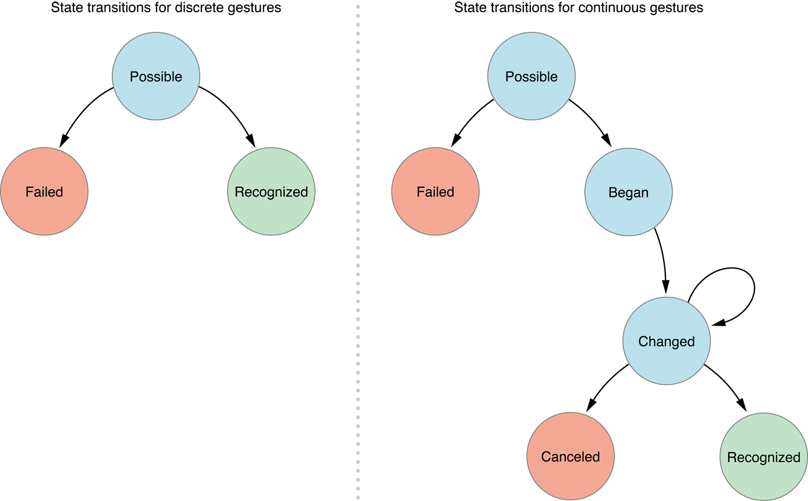

# UIGestureRecognizer

### 手势类型

IOS目前共支持六种手势，它们可分为两大类：

* 离散型手势

	* UITapGestureRecognier -- 点按手势

* 连续型手势

	* UIPinchGestureRecognizer -- 捏合手势

	* UIPanGestureRecognizer -- 拖动手势

	* UISwipeGestureRecognizer -- 轻扫手势

	* UIRotationGestureRecognizer -- 旋转手势

	* UILongPressGestureRecognizer -- 长按手势

 

### 手势状态

IOS将手势状态分为六种：

* UIGestureRecognizerStatePossible -- 默认状态，表示尚未识别是何种手势操作

* UIGestureRecognizerStateBegan -- 手势已经开始（注：此时已经被识别）

* UIGestureRecognizerStateChanged -- 手势状态发生转变

* UIGestureRecognizerStateEnded（或UIGestureRecognizerStateRecognized） -- 手势识别操作完成（注：此时已经松开手指）

* UIGestureRecognizerStateCancelled -- 手势被取消，恢复到默认状态

* UIGestureRecognizerStateFailed -- 手势识别失败，恢复到默认状态

 

### 手势状态变化过程

* 

 

### 参考
			
* [IOS手势详解](http://www.cnblogs.com/kenshincui/p/3950646.html)
* [IOS开发之手势——UIGestureRecognizer](http://www.cnblogs.com/iphone520/archive/2011/10/27/2226548.html)