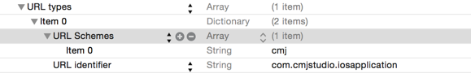

# 如何在应用B中直接唤起应用A？

### 一. 给应用A配置Url Types

具体操作方法如下：

1. 在 plist 文件中添加URL types节点；

2. 配置 URL Schemes 作为具体协议，协议名可自定义，如“test"；

3. 配置URL identifier作为这个URL的唯一标识（只要标识具有唯一性就行），如“com.xidanjueying.test"

 

### 二. 在应用B中打开以上面协议开头的url

	UIApplication *app = [UIApplication sharedApplication];
	[app openURL:@"test://xxx";]

