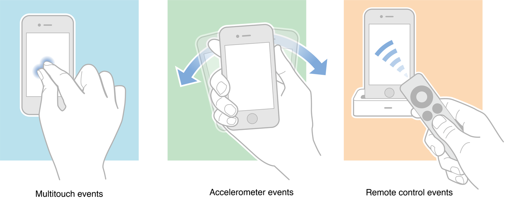
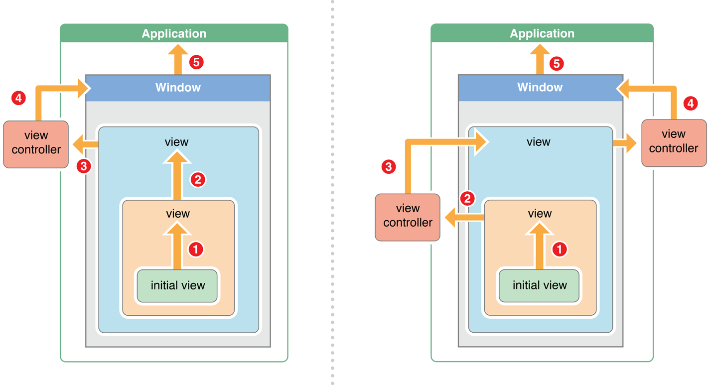

# UIEvent

### 一. 事件分类

IOS中，事件分为三类：

* 触摸事件

		描述：通过触摸、手势进行触发（如手指点击、缩放）

* 运动事件

		描述：通过加速器进行触发（如手机摇晃）
		
		事件：
			* UIEventSubtypeMotionShake -- 摇晃事件

* 远程控制事件

		描述：通过其他远程设备触发（如耳机控制按钮）
		
		事件：
			* UIEventSubtypeRemoteControlPlay -- 播放事件
			* UIEventSubtypeRemoteControlPause -- 暂停事件
			* UIEventSubtypeRemoteControlStop -- 停止事件
			* UIEventSubtypeRemoteControlTogglePlayPause -- 播放/暂停切换
			* UIEventSubtypeRemoteControlNextTrack -- 下一曲
			* UIEventSubtypeRemoteControlPreviousTrack -- 上一曲
			* UIEventSubtypeRemoteControlBeginSeekingBackward -- 快退开始
			* UIEventSubtypeRemoteControlEndSeekingBackward -- 快退结束
			* UIEventSubtypeRemoteControlBeginSeekingForward -- 快进开始
			* UIEventSubtypeRemoteControlEndSeekingForward -- 快进结束
		
		
 

### 二. IOS事件处理机制

机制简介如下（类似于浏览器DOM中的事件冒泡）：

1. 发生触摸后，事件会加入到UIApplication事件队列；

2. UIApplication从事件队列取出最前面的事件并分发处理（通常先分发给应用程序主窗口）；

3. 主窗口通过 `hitTest:withEvent:` 方法找到响应链中的第一个响应者；

4. 如果第一个响应者无法处理收到的事件，则传递给响应链中的下一个响应者，直至找到能处理的响应者为止；

5. 如果响应链中的最后一个响应者依然处理不了，则丢弃该事件。

图解响应链：

 

### 三. 谁能接收并处理事件

**只有继承自UIResponder类的对象才能处理事件**，如 UIView、UIViewController、UIApplication类。

 

### 四. 对象如何知道自己能否处理某个事件

对于继承UIResponder的对象，其不能处理事件有几个条件（满足一个即可）：

* userInteractionEnabled = NO

* hidden = YES

* alpha = 0 ~ 0.01

* 没有实现 `touchesBegan:withEvent:` 方法