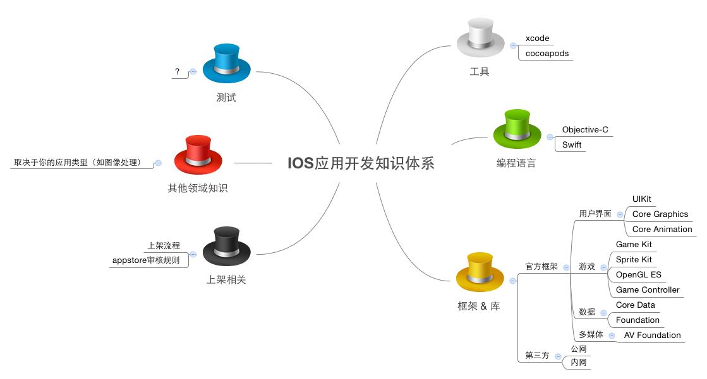

# ios-dev-resources
***

### 一. IOS应用开发知识体系
***

 

### 二. 编程语言
***

* [Objective-C](oc.md)
* Swift

 

### 三. 常用框架
***

#### **1. UIKit**

> 注：从 IOS 7.0 开始被废弃的类，不会整理在这里。

* [UIButton](UIKit/UIButton/readme.md) -- 按钮

* [UISlider](UIKit/UISlider/readme.md) -- 滑块

* [UISwitch](UIKit/UISwitch/readme.md) -- 切换

* [UIDatePicker](UIKit/UIDatePicker/readme.md) -- 日期选择

* [UIPageControl](UIKit/UIPageControl/readme.md) -- 分页

* [UIRefreshControl](UIKit/UIRefreshControl/readme.md) -- 下拉刷新

* [UISegmentedControl](UIKit/UISegmentedControl/readme.md) -- 类似PC端的tabbar

* [UIStepper](UIKit/UIStepper/readme.md) -- 增减器

* [UITextField](UIKit/UITextField/readme.md) -- 文本输入框

* [UIAccessibilityElement](UIKit/UIAccessibilityElement/readme.md) -- 让 APP 支持无障碍

* [UINavigationController](UIKit/UINavigationController/readme.md) -- 导航控制器

* [UINavigationBar](UIKit/UINavigationBar/readme.md) -- 导航条

* [UINavigationItem](UIKit/UINavigationItem/readme.md) -- 导航项，管理显示在导航条上的按钮和视图

* [UITabBarController](UIKit/UITabBarController/readme.md) -- tabbar控制器

* [UITabBar](UIKit/UITabBar/readme.md) -- tabbar

* [UITabBarItem](UIKit/UITabBar/readme.md) -- 显示在tabbar上的视图项

* [UIBarButtonItem](UIKit/UIBarButtonItem/readme.md) -- 显示在导航条和工具条上的按钮

* [UIPopoverController](UIKit/UIPopoverController/readme.md) -- 弹出层控制器

* [UIMenuController](UIKit/IMenuController/readme.md) -- 菜单控制器

* [UIMenuItem](UIKit/UIMenuItem/readme.md) -- 菜单项

* [UIPickerView](UIKit/UIPickerView/readme.md) -- 滚轮选择器

* [UIGestureRecognizer](UIKit/UIGestureRecognizer/readme.md) -- 手势基础类

* UILongPressGestureRecognizer -- 长按

* UIPanGestureRecognizer -- 拖移

* UIPinchGestureRecognizer -- 二指往內或往外拨动

* UIRotationGestureRecognizer -- 旋转

* UISwipeGestureRecognizer -- 滑动

* UITapGestureRecognizer -- 点一下

* [UIWindow](UIKit/UIWindow/readme.md) -- 窗口对象

* [UIAlterView](UIKit/UIAlertView/readme.md) -- alert对话框

* [UIActionSheet](UIKit/UIActionSheet/readme.md) -- 动作表

* [UILocalNotification](UIKit/UILocalNotification/readme.md) -- 本地通知

* [UILabel](UIKit/UILabel/readme.md) -- 显示只读文本

* [UIImage](UIKit/UIImage/readme.md) -- 载入图像数据

* [UIImageView](UIKit/UIImageView/readme.md) -- 显示图像

* [UIImagePickerController](UIKit/UIImagePickerController/readme.md) -- 拍照、摄像、从app中选择照片和视频

* [UIProgressView](UIKit/UIProgressView/readme.md) -- 进度条

* [UIScrollView](UIKit/UIScrollView/readme.md) -- 幻灯片

* [UITextView](UIKit/UITextView/readme.md) -- 类似于 html 中的 textarea

* [UICollectionView](UIKit/UICollectionView/readme.md) -- 以自定义布局的方式管理有序数据集合

* [UITableViewController](UIKit/UITableViewController/readme.md)

* [UITableView](UIKit/UITableView/readme.md) -- 表格视图

* UIWebView

* UIInputView

* [UISearchBar](UIKit/UISearchBar/readme.md) -- 搜索条

* [UISearchController](UIKit/UISearchController/readme.md) -- 搜索控制器

* [UIVisualEffectView](UIKit/UIVisualEffectView/readme.md) -- 图像虚化

* [UIToolbar](UIKit/UIToolbar/readme.md) -- 工具条

 

#### **2. 蓝牙框架**

* GameKit

* MultipeerConnectivity

* CoreBluetooth

 

#### **3. 社交分享**

* [Social](http://www.cnblogs.com/kenshincui/p/4220402.html#social)

 

#### **4. Assets Library**

* [AssetsLibrary](https://developer.apple.com/library/ios/documentation/AssetsLibrary/Reference/AssetsLibraryFramework/index.html)
* [Photos](https://developer.apple.com/library/ios/documentation/Photos/Reference/Photos_Framework/index.html#//apple_ref/doc/uid/TP40014408) 【IOS8开始可用】
* [iOS相册多选照片](http://www.iphonetrain.com/blog_info/68.html)

 

#### **5. 通讯录**

* [AddressBook](http://www.cnblogs.com/kenshincui/p/4220402.html#contact)

 

#### **6. 地理定位**

* CoreLocation

 

#### **7. 地图**

* MapKit

 

### 四. 常用的第三方库
***

* [MBProgressHUD](https://github.com/jdg/MBProgressHUD) -- 进度指示器（如常见的“加载中...”）
* [AFNetworking](https://github.com/AFNetworking/AFNetworking) -- 处理网络请求
* [SDWebImage](https://github.com/rs/SDWebImage) -- 支持缓存的图片延迟加载
* [EGOTableViewPullRefresh](https://github.com/enormego/EGOTableViewPullRefresh) -- 上拉刷新
* [JSONKit](https://github.com/johnezang/JSONKit) -- json处理
* [ISHPermissionKit](https://github.com/iosphere/ISHPermissionKit) -- 以统一的方式请求用户授权
* [TBXML](https://github.com/71squared/TBXML) -- XML解析
* [ZBarSDK](https://github.com/bmorton/ZBarSDK) -- 二维码扫描
* [ObjQREncoder](https://github.com/jverkoey/ObjQREncoder) -- 二维码生成
* [KINWebBrowser](https://github.com/dfmuir/KINWebBrowser) -- 同时兼容WKWebView和UIWebView
* [MMDrawerController](https://github.com/mutualmobile/MMDrawerController) -- 侧边抽屉导航
* [Reachability](https://github.com/tonymillion/Reachability) -- 检测iOS设备网络环境的库（目标网络是否可用、网络的连接方式及连接方式的变更）
* [PushSharp](https://github.com/Redth/PushSharp) -- 用来给APNS发送消息的库
* [Masonry](https://github.com/Masonry/Masonry) -- 自动布局
* [ios-charts](https://github.com/danielgindi/ios-charts)
* [MJRefresh](https://github.com/CoderMJLee/MJRefresh) -- 下拉上拉刷新
* [SWTableViewCell](https://github.com/CEWendel/SWTableViewCell) -- UITableViewCell侧滑按钮
* [PromiseKit](https://github.com/mxcl/PromiseKit) -- Promise的iOS版本
* [FormatterKit](https://github.com/mattt/FormatterKit) -- 强大的格式化工具包
* [CocoaLumberjack](https://github.com/CocoaLumberjack/CocoaLumberjack) -- Mac 和 iOS 的一款强大的日志框架（原生支持XcodeColors插件）
* [100个优秀IOS开源项目](http://www.jianshu.com/p/769ce426b5db)
* [ReactiveCocoa](https://github.com/ReactiveCocoa/ReactiveCocoa) -- 函数响应式编程框架
* [PonyDebugger](https://github.com/square/PonyDebugger)
* [PonyDebugger使用详细说明](http://shiningio.com/2014/03/20/debug-ios-app-with-pony-debugger/)
* [Mantle](https://github.com/Mantle/Mantle) -- 数据建模框架
* [JSONModel](https://github.com/icanzilb/JSONModel) -- JSON转模型框架
* [MJExtension](https://github.com/CoderMJLee/MJExtension) -- 字典转模型框架
* [nui](https://github.com/tombenner/nui) -- 通过CSS的方式来定义iOS app的样式
* [GrowingTextView](https://github.com/HansPinckaers/GrowingTextView) -- 自适应内容高度的textview
* [FMDB](https://github.com/ccgus/fmdb) -- 对SQLite的包装，让使用SQLite更方便
	* [FMDB官方使用文档中文版](http://www.cocoachina.com/industry/20130819/6821.html)
* [MagicalRecord](https://github.com/magicalpanda/MagicalRecord) -- 让使用Cora Data更方便
* [RegexKitLite](https://github.com/wezm/RegexKitLite) -- 正则表达式库
* [iOS图表库](https://github.com/sxyx2008/awesome-ios-chart)

 

### 五. 参考资料
***

* [IOS开发教程（官方中文版）](https://developer.apple.com/LIBRARY/ios/referencelibrary/GettingStarted/RoadMapiOSCh/FirstTutorial.html#//apple_ref/doc/uid/TP40012668-CH3-SW1)
* [IOS开发官方示例代码](https://developer.apple.com/library/ios/navigation/#section=Resource%20Types&topic=Sample%20Code)
* [App Programming Guide for iOS](https://developer.apple.com/library/ios/documentation/iPhone/Conceptual/iPhoneOSProgrammingGuide/Introduction/Introduction.html#//apple_ref/doc/uid/TP40007072)
* [IOS人机界面指南（官方英文版）](https://developer.apple.com/library/ios/documentation/UserExperience/Conceptual/MobileHIG/IconMatrix.html#//apple_ref/doc/uid/TP40006556-CH27-SW1)
* [IOS7人机界面指南（中文版，腾讯团队翻译）](http://isux.tencent.com/ios-human-interface-guidelines-ui-design-basics-ios7.html)
* [App store最新审核标准(2015.3)](https://github.com/leecade/ios-dev-flow/blob/master/Appstore%E6%9C%80%E6%96%B0%E5%AE%A1%E6%A0%B8%E6%A0%87%E5%87%86_2015-3.md)
* [UIView与CALayer的区别](http://blog.csdn.net/weiwangchao_/article/details/7771538)
* [自动布局教程(1) 中文版](http://www.cocoachina.com/industry/20131203/7462.html)
* [自动布局教程(2) 英文版](http://www.raywenderlich.com/50319/beginning-auto-layout-tutorial-in-ios-7-part-2)
* [iOS开发之xib技巧介绍](http://www.cocoachina.com/industry/20140529/8603.html)
* [结队开发之多storyboard](http://www.cocoachina.com/industry/20140530/8620.html)
* [storyboard使用简介](http://www.cocoachina.com/industry/20131213/7537.html)
* [手写UI & xib & storyboard](http://www.cocoachina.com/industry/20140102/7640.html)
* [Xcode应用程序构建阶段（Build Phases）分析（1）](http://www.entlib.net/?p=1645)
* [Xcode应用程序构建阶段（Build Phases）分析（2）](http://www.entlib.net/?p=1654)
* [初探 iOS8 中的 Size Class](http://blog.csdn.net/pleasecallmewhy/article/details/39295327)
* [iphone6 屏幕特性图解](http://www.paintcodeapp.com/news/iphone-6-screens-demystified)
* [iOS8中LaunchImage和LaunchScreen的完美结合](http://www.simpleapples.com/2014/10/launchsreen-and-launchimage/)
* [IOS基础 -- 静态库](http://www.cnblogs.com/monicaios/p/3539920.html)
* [IOS基础 -- 内存分析](http://www.cnblogs.com/monicaios/p/3541095.html)
* [苹果开发者账号那些事儿（一）账号类型](http://ryantang.me/blog/2013/08/28/apple-account-1/)
* [苹果开发者账号那些事儿（二）证书](http://ryantang.me/blog/2013/09/03/apple-account-2/)
* [苹果开发者账号那些事儿（三）配置文件](http://ryantang.me/blog/2013/11/28/apple-account-3/)
* [Prefix.pch文件详解](http://blog.csdn.net/duxinfeng2010/article/details/8287550)
* [深入浅出Cocoa](http://blog.csdn.net/column/details/cocoa.html)
* [Apple移动设备处理器指令集 armv6、armv7、armv7s及arm64](http://www.cocoachina.com/ios/20140915/9620.html)
* [iOS生成静态库方法-iOS集成静态库-iOS合并静态库](http://blog.sina.com.cn/s/blog_7b9d64af0101jlym.html)
* [在iOS中创建静态库](http://www.cocoachina.com/industry/20131204/7468.html)
* [使用CocoaPods开发并打包静态库](http://www.itjhwd.com/cocoapods-kajbk/)
* [Coding Guidelines for Cocoa](https://developer.apple.com/library/mac/documentation/Cocoa/Conceptual/CodingGuidelines/CodingGuidelines.html)
* [堆和栈的区别](http://blog.csdn.net/hairetz/article/details/4141043)
* [Core Animation编程指南](http://www.cocoachina.com/bbs/read.php?tid=84461)
* [多线程编程指南](http://www.cocoachina.com/bbs/read.php?tid=87592)
* [关于viewWithTag的一点说明](http://blog.csdn.net/smking/article/details/8590547)
* [判断是否有权限访问相机、相册、定位](http://blog.csdn.net/cafei111/article/details/25793145)
* [push vc时如何隐藏tabbar之hidesBottomBarWhenPushed的使用](http://www.isaced.com/post-223.html)
* [解决[UIColor colorWithRed: green: blue: alpha:] 失效问题](http://blog.csdn.net/chaoyuan899/article/details/27321235)
* [UIImagePickerController选择图片发送后旋转90度的问题](http://blog.csdn.net/mideveloper/article/details/44101267)
* [https://github.com/vsouza/awesome-ios](https://github.com/vsouza/awesome-ios)
* [如何使用NSCoding和NSFileManager来保存你的应用程序数据](http://www.cnblogs.com/andyque/archive/2011/09/13/2164469.html)
* [IOS Table中Cell的重用reuse机制分析](http://blog.csdn.net/omegayy/article/details/7356823)
* [基础集合类](http://www.cocoachina.com/ios/20140122/7735.html)
* [iOS如何实现表格的折叠效果?](http://blog.csdn.net/youcanping2008/article/details/9202167)
* [如何解决sizeWithAttributes获取的字符串尺寸偏小的问题](http://stackoverflow.com/questions/18897896/replacement-for-deprecated-sizewithfont-in-ios-7)
* [开源项目汇总](https://github.com/Tim9Liu9/TimLiu-iOS)
* [MVVM 介绍](http://objccn.io/issue-13-1/)
* [几种通信方式的区别](http://www.objc.io/issues/7-foundation/communication-patterns/)
* [ReactiveCocoa指南一：信号](http://southpeak.github.io/blog/2014/08/02/reactivecocoazhi-nan-%5B%3F%5D-:xin-hao/)
* [ReactiveCocoa2实战](http://www.cocoachina.com/industry/20140609/8737.html)
* [在iOS开发中调用icon font字体的代码](http://www.weste.net/2013/12-13/94694.html)
* [iOS的基本的设计模式](http://blog.csdn.net/totogo2010/article/details/8028180)
* [iOS应用程序生命周期详解](http://blog.csdn.net/totogo2010/article/details/8048652)
* [IOS 内存警告 Memory warning level](http://www.cnblogs.com/smileEvday/archive/2012/03/07/MemoryWarning.html)
* [代码签名探析](http://objccn.io/issue-17-2/)
* [iOS代码签名](http://www.cocoachina.com/ios/20141017/9949.html)
* [NSCoding / NSKeyed​Archiver](http://nshipster.cn/nscoding/)
* [iOS中常用的四种数据持久化方法简介](http://www.cocoachina.com/industry/20130328/5908.html)
* [iOS中几种数据持久化方案](http://www.jianshu.com/p/7616cbd72845)
* [iOS中集合遍历方法的比较和技巧](http://www.cocoachina.com/industry/20140531/8630.html)
* [iOS 8.0+如何在应用中唤起系统设置界面](http://itony.me/875.html)

 

### 六. 测试

* [OCUnit+xctool进行单元测试](http://blog.csdn.net/sqc3375177/article/details/40857313)
* [测试框架](http://www.infoq.com/cn/articles/build-ios-continuous-integration-platform-part2)

 

### 七. 工具
***

* [生成appstore审核截图](https://appscreens.io/yK7cLuBNij)
* [cocoa controls](https://www.cocoacontrols.com/) -- 可以收集你的组件被哪用于哪些应用

 

### 八. 高大上技术资源
***

* [云端人脸识别API](https://rekognition.com/)
* [讯飞开放平台](http://www.xfyun.cn/)
* [微信语音SDK(iOS 版)上手指南](http://pr.weixin.qq.com/voice/sdkios)
* [语音识别](http://blog.csdn.net/shenjx1225/article/details/18549409)
* [Google，微软，科大讯飞的语音识别引擎对比](http://blog.csdn.net/yylsheng/article/details/8364487)
* [IOS中手势密码界面的实现](http://blog.csdn.net/skylin19840101/article/details/38729757)
* [手势解锁](http://blog.csdn.net/becomedragonlong/article/details/43704017)
